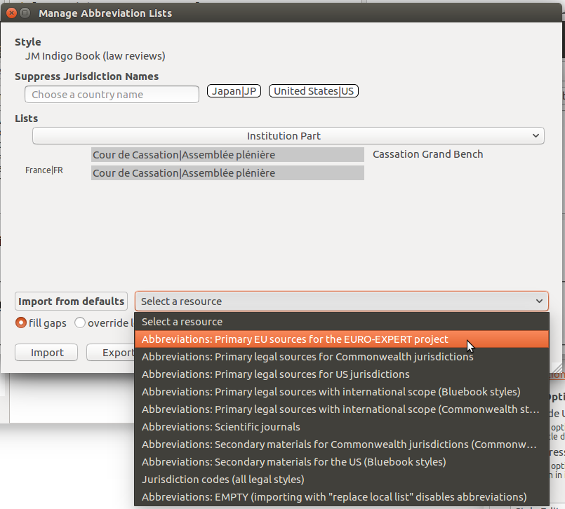

================================
Tutorial: managing abbreviations
================================

.. include:: substitutions.txt
|CCBYSA|_ `Frank Bennett <biercenator@gmail.com>`_

~~~~~~~~~~~~
Introduction
~~~~~~~~~~~~

Citations are a compact expression of the essential details needed to
retrieve the cited material. To reduce the bulk of text in citations,
many styles apply uniform abbreviations to journal titles. Legal
styles have more complex conventions, applying abbreviations to court
and jurisdiction names. Jurism contains and Abbreviation Filter that
can be used to control and customize the abbreviations applied by any
style.

To illustrate the use of the Abbreviation Filter, this tutorial walks
through configuration of the Indigobook Law Review style to render
citations to Austrian and French court judgments.

The sample items in this tutorial are drawn from the Jurism Style Test
Items library, which contains sample items for a range of
materials. See the related `tutorial <./sample-library.html>`_ for
details on accessing this library.

~~~~~~~~~~~~~~~~~~~~~~~~~~~~~~~
Opening the Abbreviation Filter
~~~~~~~~~~~~~~~~~~~~~~~~~~~~~~~

Open the Abbreviation Filter by pressing the **Abbrevs** button that
is displayed in the Style Editor view of Jurism. The button is also
available in the Quick Format (or "red ribbon") word processor
citation dialog and the Classic word processor citation dialog, and
works in exactly the same way. (In a word processor, the button may be
greyed out until citations have been refreshed.)

After selecting an item in the center pane of Jurism, we open the
Preferences dialog, select the Cite tab, and click on the **Style
Editor** button to open the style editor.

In the style editor, we select a style, and citation samples appear
in the popup:

We see that there is a problem: the court name is showing as
``cass~plen``, which is not at all right. To fix this, we need to
configure abbreviations for this style. Clicking on the **Abbrevs**
button opens the Abbreviation Filter:

~~~~~~~~~~~~~~~~~~~~~~~~~~~~~~~~~~
Selecting an abbreviation category
~~~~~~~~~~~~~~~~~~~~~~~~~~~~~~~~~~

Abbreviations are organized into categories. The currently selected
category name is shown in a button that spans the width of the
dialog box. By default the **Journal, Reporter** list is selected.
In our citation, the court name is in the wrong form, so we need to
choose a different list. Ordinary court names are controlled by
the **Institution Part** list, so we click on the wide button and
select that list:

           
In the **Institution Part** list, oaur court shows up as *Cour de
Cassation|Assemblée plénière*, which is more informative, but still
not correct.

^^^^^^^^^^^^^^^^^^^^^
Editing abbreviations
^^^^^^^^^^^^^^^^^^^^^

We see that the name of our court is listed twice—once with no label,
and once with the label ``France|FR``, both with editable bubbles for
registering an abbreviation. An abbreviation set on the entry with no
label will be applied to this key whenever it appears in the Court
field (or any other field that carries an institution name). An
abbreviation set on the ``France|FR`` entry will be applied only to
items with France (or a subjurisdiction of France) set in the
Jurisdiction field.

Generally speaking, it is a good policy to set abbreviations on the
most specific jurisdiction shown, but for demonstration purposes,
we will set an arbitrary "abbreviation" on the unlabeled entry:

When we save the entry (by pressing Enter), close the dialog, and
click on the **Refresh** button, our "abbreviation" shows up in the
citation:

^^^^^^^^^^^^^^^^^^^^^^^^^^^^^^^^^^^^^^^^
Applying pre-packaged abbreviation lists
^^^^^^^^^^^^^^^^^^^^^^^^^^^^^^^^^^^^^^^^

Our abbreviation entry was just a wild guess. We could dig out a set
of French legal style manuals to get the correct abbreviation, but in
this case there is an easier way. The abbreviations needed to render
the EURO-EXPERT citations are collected in a pre-packaged list bundled
with Jurism. If we add that list to the Abbreviation Filter entries
for the current style, our citation should come out correctly.

To begin, we click on the button **Select a resource** to the right of
the **Import from defaults** label to open a pulldown listing the
bundled abbreviation lists. (If label to the left instead reads
"Import from file," clicking on it will switch the import mode to
"Import from defaults.") We select the list "Primary EU sources
for the EURO-EXPERT project".

After selecting our list, we choose an import mode, then click on the
**Import** button to add the list entries to the Abbreviation Filter
for this style. The import modes "fill gaps," "override local entries,"
and "replace local list" have the effects that they describe.
            

After selecting the list, closing the Abbreviation Filter dialog and
clicking **Refresh**, we are greeted with a correctly formatted
citation.

            

All of the sample items with the EURO-EXPERT tag should now render
correctly, in Style Editor and word processor alike.
