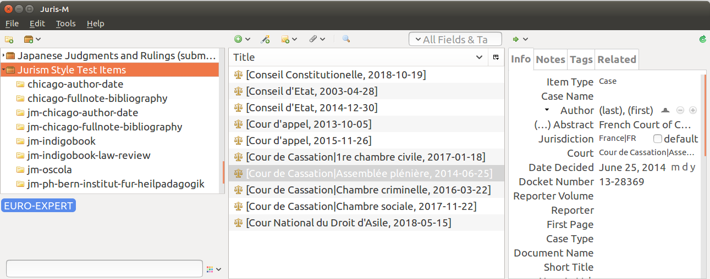

=================================
Tutorial: Jurism Style Test Items
=================================

.. include:: substitutions.txt
|CCBYSA|_ `Frank Bennett <biercenator@gmail.com>`_

The Jurism Style Test Items public library contains sample items
for a range of legal and other materials. Items in the library
are used to test the Jurism styles, and also serve as a useful
reference for the care and feeding of personal collections.

If you have a Zotero account, you can join the library by `visiting
its page
<https://www.zotero.org/groups/2319948/jurism_style_test_items>`_ and
clicking on the **Join** button. In a Jurism client set to sync to
your account, the group library will appear in the left-hand pane of
Jurism the next time you sync.

Items in the library are organized into collections named for
individual citation styles for testing purposes, but (in theory at
least) any item can be used with any style. You can use the tag filter
to select items in a particular category.  The illustration below
shows a view of the library limited to items drawn from the EURO-EXPERT
project.

