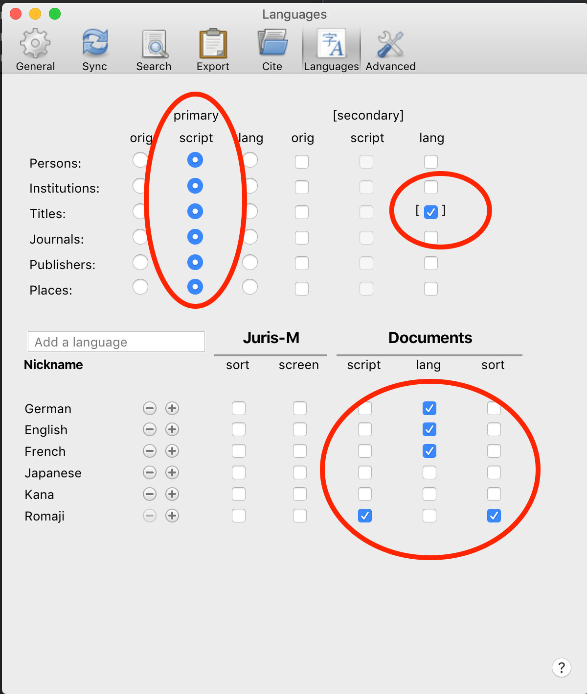
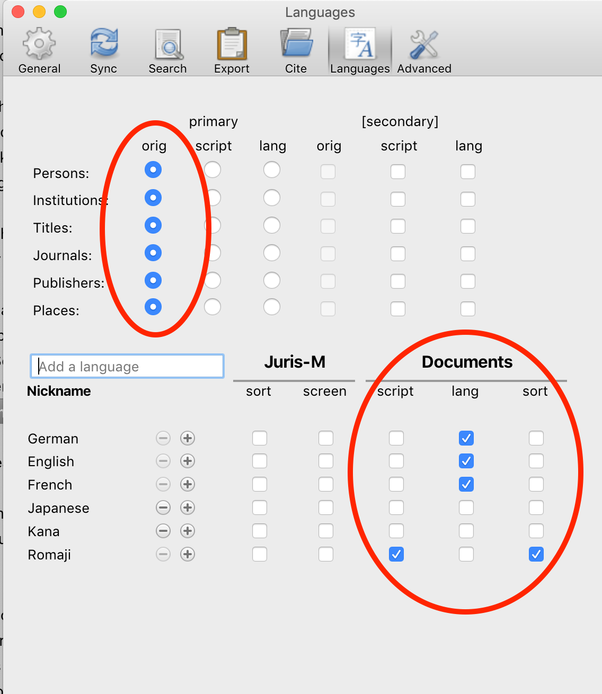

========================================================
多言語出版物と文献目録
========================================================

.. include:: substitutions.txt
|CCBYSA|_ `ジョナサン・ルイス <http://www.soc.hit-u.ac.jp/en/academics/faculty/lewis.html>`_
|CCBYSA|_ 豊崎玲子

~~~~~~~~~~~~~~~
イントロダクション
~~~~~~~~~~~~~~~

注記：
このチュートリアルは、2019年３月にリリースされたJurisｍの最新ベータバージョンを使用しています。

あなたが社会科学者（あるいは人文学学者、あるいはその他の研究者）であれば、複数の言語で書かれた先行研究を読んだとき、これらのすべての参考文献を記録し管理する方法が必要になります。また英語と他の言語で論文を書くこともあるでしょう。

各ジャーナルには、それぞれ、文献目録の書式に関する独自の要件があります。たとえば、あなたが英語の論文の中に、日本語の文献を引用するとき、著者名、題名その他を欧文字で書き、且つ題名の英訳をつけくわけなければなりません。しかし、日本語の論文の中で同じ日本語の文献を引用するときにはオリジナル情報のみで足ります。Jurismを使うと、引用書式を作成するために必要なすべての情報を一元管理でき、異なる引用書式を作成することができます。つまり、あなたは、言語や情報の種類に関わらず、全引用文献を一つのデータベースで管理し、各論文の全情報を一元に管理することができるのです。さらによいことには、Jurismは、あなたが書いているジャーナルの書式要件に沿った文献目録を、言語が何であれ、自動的に生成してくれます。

このチュートリアルでは、日本の捕鯨に関する研究を行っていることを想定します。日本語と英語で関連する情報を収集し、英語と日本語による２本の論文を書くことを想定します。

~~~~~~~~~~~~~~~~~~~~~~~~~~~~~~~~~
多言語情報を保管するためのJurismの設定
~~~~~~~~~~~~~~~~~~~~~~~~~~~~~~~~~

英語の論文の中で日本語の文献を引用するときは、題名、著者名などを漢字やかなではなく、欧文字で記載する必要があります。同時に、日本語の論文を作成する際、文献目録は、著者名の読みがなの順でソートしなければなりません。

これらのため、Jurisｍの言語選択に英語、日本語、ローマ字およびカナを入力箇所として設ける必要があります。以下のビデオを参照してください。
メニューの中のJurisｍの言語選択を開いたら「Languages」タブをクリックします。そして、「Language」の追加をクリックし、「English」を追加します。略称を「en」から「English」 に変更します。(略称の設定は、ご自身の好みで設定できます。「en」のままでもOKです)。
つぎに、おなじ要領で「Japanese」を追加します。「Japanese」のよこにある「Plus」をクリックし、サブメニューの中から、「ALA-RC　Romanization, 1997 Edition」を選択します。これについても略称を「ja-alalc97」から「Romaji」に変更します。最後に、「Japanese」のよこの「＋」をクリックし、サブメニューから「Japanese syllabaries (alias for Hiragana + Katakana) – Hrkt」を選択します。これについても、略称を「ja-Hrkt」 から「Kana」に変更しておきます。

以上の設定は一度きりの作業です。
Jurisｍを使用しているかぎり、キープされます。たとえ、これらの設定からひとつの言語を削除しても、収集した項目のデータが消えることはありません。

.. raw:: html

    

        <iframe src="https://www.youtube.com/embed/TnlCLDChIWQ" frameborder="0" allowfullscreen style="position: absolute; top: 0; left: 0; width: 100%; height: 100%;"></iframe>
    

~~~~~~~~~~~~~~~~~~~~~~~~~~
文献目録情報をJurismに取り込む
~~~~~~~~~~~~~~~~~~~~~~~~~~

Jurismの強みの一つは、ウェブブラウザ―から、文献目録情報を認識し、ウェブページに含まれている文献目録情報を持ってくることができる点です。

以下のビデオはJurismの中に、新しい文献を集め、４つの捕鯨に関する文献を追加する場面を示しています。捕鯨に関する情報CiNiiサーチにて、捕鯨に関する項目をサーチし、森下による日本の論文を追加します。日本のアマゾンのページにて、Dolinの英文書籍情報を見つけました。さらに、GoogleScholarで、Blokの英文記事を確認しました。最後に、日本のアマゾンにもどって、赤嶺の日本語書籍をみつけました。Jurisｍにこれらの選択した収集情報をどのように追加するのか、注目してください。

.. raw:: html

    

        <iframe src="https://www.youtube.com/embed/8a-enPbggWM" frameborder="0" allowfullscreen style="position: absolute; top: 0; left: 0; width: 100%; height: 100%;"></iframe>
    

	

フォルダーを生成し、タグを追加することで、すべての参考文献をJurismにて管理することができます。同じ項目は、マルチフォルダーの中に入れることができます。PDFのリンクを追加することもできます。詳細については、 `Zotero documentation <https://www.zotero.org/support/>`_ の「Using Zotero」を参照してください。

既にお気づきでしょうが、Jurismに情報を保管するための第一かつもっとも重要な原則は、メタデータは常に、第一にまずオリジナルの言語で記録する、ということです。翻訳や音訳は必要に応じて後から入力することができます。しかし、引用の目的は読者あるいは研究者に原文を辿れるようにすることにあります。英語の翻訳として、ロシア語、クメール、ラオ後あるいは日本語で題名が記載されていたら、原文を探したいと思う読者は、原文のタイトルを想像するよりありません、そして、データが見つからない事態に。したがって、すべてのメタデータ（日付を除き）は。原文の言語で記録されるべきです。異なる言語は、後日、別に追加することができるのです。

~~~~~~~~~~~~~~~~~~~~~~~
英語論文の中での多言語の引用
~~~~~~~~~~~~~~~~~~~~~~~

ここに、「Journal of Asian Studies」へ提出するための現行を用意しました。このジャーナルの`information page <https://www.cambridge.org/core/journals/journal-of-asian-studies/information/instructions-contributors>`_ には、シカゴマニュアル様式16版に従うようにという指示があります。

ジャーナルのウェブページ上にある事例を参照しますと、非英語の論文は下記の書誌に基づいて書かれています。

BAN CHẤP HÀNH ĐẢNG BỘ TỈNH BẠC LIÊU. 2002. *Lịch sử Đảng bộ tỉnh Bạc Liêu (1927– 1975)* [History of the party in Bạc Liêu Province]. Vol. 1. Bạc Liêu: Ban Thường Vụ Tỉnh Ủy.

したがって、すべての日本語文献は、ローマ字で表現し、タイトルの英訳を大括弧で記載する必要があります。

森下による日本語文献と、赤嶺の書籍を、論文の中で引用します。現段階では、私たちは、題名、著作者名情報を漢字/かなでしかもっていませんので、これらをローマ字に音訳する必要があります。さらに、赤嶺の書籍は題名を英語に翻訳しなければなりません。まず、Jurism上にて、各文献がどの言語であるかを記録しなければなりません。言語に関する情報は2文字言語コード（ja, enなど）を用いて、言語フィールドの中に記載します。

注記：ここで使えるのは２文字言語コードであり、（英語、日本語などの）言語名を使用することはできません。そのため、もし、言語フィールドに言語名で設定していたならば、２文字コードに変更しなければなりません。

つぎに、各関連フィールドのラベルを右クリックし、「Add Variant」を選択し、文献のローマ字による音訳および英語の翻訳を記載します。

.. raw:: html

    

        <iframe src="https://www.youtube.com/embed/TXOqmMtS5yk" frameborder="0" allowfullscreen style="position: absolute; top: 0; left: 0; width: 100%; height: 100%;"></iframe>
    

自分の論文で、引用する準備ができたら、Jurismの言語選択（language preference）は以下となっているはずです。

（私は過去にドイツ語とフランス語文献を引用したため、わたしの設定にはドイツ語とフランス語がはいっています）

この設定画面の上部のテーブルは、原文言語の「スクリプト」を使用することを示しています。このケースでは日本語はローマ字で表されます。さらに、日本語文献のタイトルは、英語に翻訳されたものを追加するため、［］に印が追加されています。

この設定画面の下半分のテーブルは、Jurismが文献目録をどのような順序でソートするかを示すものです。日本語文献は、著者名のローマ字順にソートされることになります。

では、次に進んで、英語論文への引用追加と文献目録にいきましょう。最初の引用を追加する前にJurismの言語設定をチェックすることをわすれないでください。設定は後から変更することから可能であるとしても、最初から設定しておくことで混乱を防ぐことができます。最初に引用を論文に追加するとき、その時点でのJurismの言語設定が論文にコピーされます。したがってWordの中での文献目録の書式に影響を及ぼさずに、Jurismの言語設定を後に変更することができます。

.. raw:: html

    

        <iframe src="https://www.youtube.com/embed/7lcx3gohTyw" frameborder="0" allowfullscreen style="position: absolute; top: 0; left: 0; width: 100%; height: 100%;"></iframe>
    

~~~~~~~~~~~~~~~~~~~~~~~~~
日本語の論文における多言語引用
~~~~~~~~~~~~~~~~~~~~~~~~~

次に取り上げるのは、「Japanese Sociological Review (日本社会学会)」誌のための日本語による捕鯨の論文です。この学会誌には、詳細な様式ガイド`style guide <http://www.gakkai.ne.jp/jss/bulletin/guide.php>`_ があります。Jurismはこの様式を改良し、正しい情報を適切なフィールドに入力しているかぎり、簡単に、引用を自分の論文の中に追加するだけで、Jurismには適切な様式の文献目録のための収集作業を行せることができます。

ここで、英語の論文で用いたものと同じ４つのソースを引用します。すでに各文献は、Jurismの中に取り込まれていますので、それを引用し、記述することができます。なお私たちは、Dolinの書籍を日本語に翻訳されていることを知っていますし、その翻訳を使いたいところです。そこで、下記に示すように、この文献の言語フィールドを“en>ja”とし、この文献の追加フィールドの中に、翻訳情報を入力します。
各翻訳者はそれぞれ<alt-translator>に入力します。さらに翻訳者の姓名は、複縦線“||”によって分けて入力します。

.. image:: ./media/AddingTranslationInfo.png

Wordで記載する論文に引用文献を追加し始める前に、私たちは、Juirismの言語選択を再び設定する必要があります。日本語の文書に翻訳する必要も英語の翻訳も加える必要がないので、この上部の設定はとても簡単です。これは、学会の様式ガイドラインが、すべての文献は（どんな言語であれ）著者名のローマ字順であることを求めているからです。他方、これは、たとえ、引用する文献の著者/編者名のローマ字表記が表示されていなくとも、引用しようとする文献の著者/編集者のローマ字表記を入力しなければならないということを意味します。

この段階で、自身の論文に引用文献と文献目録を追加します。Wordに引用文献を追加する際、ローマ字を使用した文献を探すようにと、（“Blok”, ”Leviathan”など）赤枠のウインドウが表れますが、諸理由から、日本語のテキストの場合には現れません。日本語の論文に引用文献を挿入する際には、Jurism　アイコンをクリックし、”Classic View”を出し、引用したい文献を選択する必要があります。

.. raw:: html

    

        <iframe src="https://www.youtube.com/embed/HFsRLQIDjN4" frameborder="0" allowfullscreen style="position: absolute; top: 0; left: 0; width: 100%; height: 100%;"></iframe>
    

Jurismは、学会編集の要求する様式が、翻訳や再刊などのような複雑な入力を様式化していたとしても、正確にその要求に従って様式化します。より複雑な項目を正しく表示する方法について理解するためには、この`shared library <https://www.zotero.org/groups/2295917/japan_sociological_society_examples?>`_ を参照してください。このライブラリには、ジャーナルの様式ガイドの中に示されている異なる事項やバリエーションが含まれています。

ここで、あなたはこう思うかもしれません。「あっ、でも今、Dolisの書籍の翻訳についての情報を追加した。次回、英語の論文で、日本語翻訳版を引用するし」と。大丈夫。Jurismはあなたが英文ジャーナルのために記載している様式設定の中から、見つけ出し、原書の詳細のみを提供します。

------------

（実際のところ、JSR様式ガイドの中には、Jurismでは対処できない些細だけれども頭を悩ませる指示が一つあります。共著作品で、少なくとも一人の著作者名がカナで表示される場合です。この場合には、著者名を区切る中黒（・）をスラッシュに(/)に代えるしかありません。

例

カナで表示される著作者がいない場合：

宮島喬・梶田孝道・伊藤るり，1985，『先進社会のジレンマ』有斐閣．

カナで表示される著作者がいる場合：

西垣通／ジョナサン・ルイス，2001，『インターネットで日本語はどうなるか』岩波書店．

もし、このような文献を引用する際には、文献目録を提出前に手入力で編集しなければなりません。)

もしわからない点があれば、`Jurism-support <https://mail.law.nagoya-u.ac.jp/mailman/listinfo/jurism-support>`_ 又は `Jurism-freshers <https://mail.law.nagoya-u.ac.jp/mailman/listinfo/jurism-freshers>`_ にメールしてください。