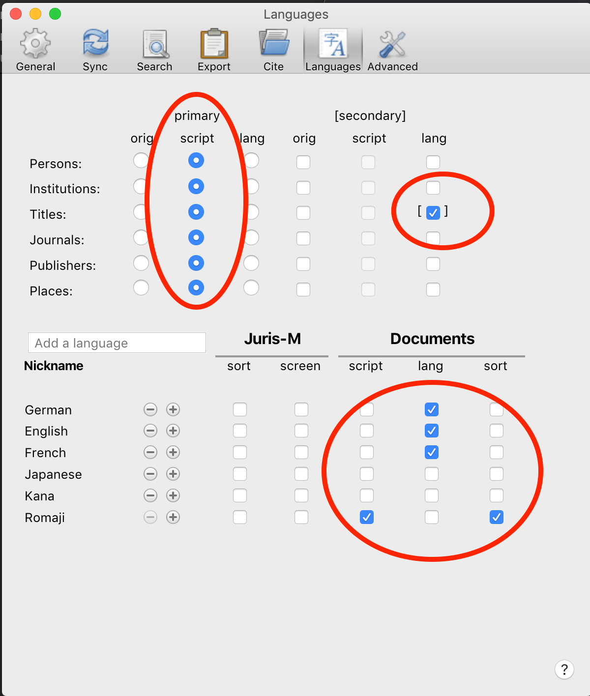
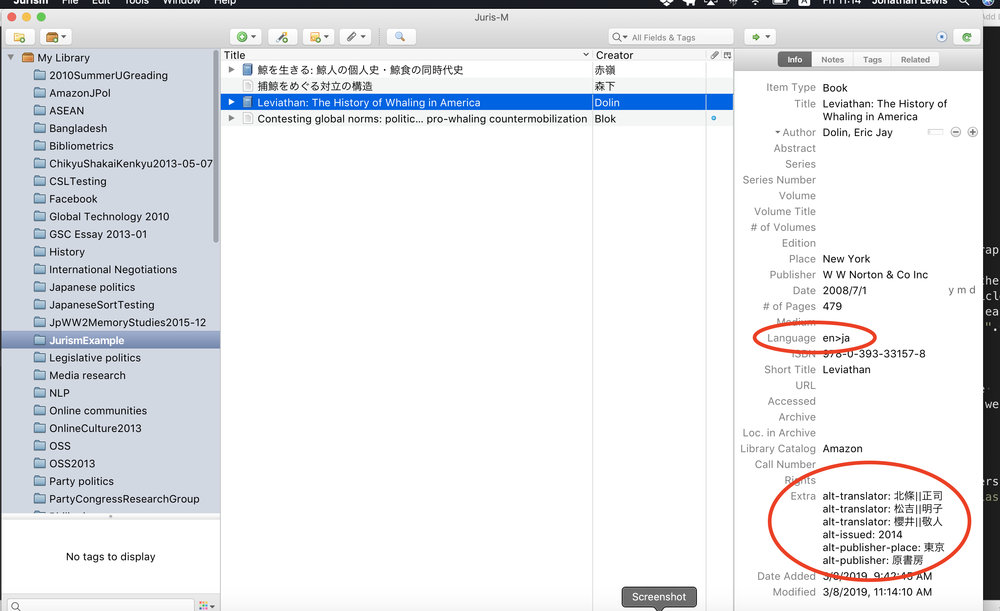
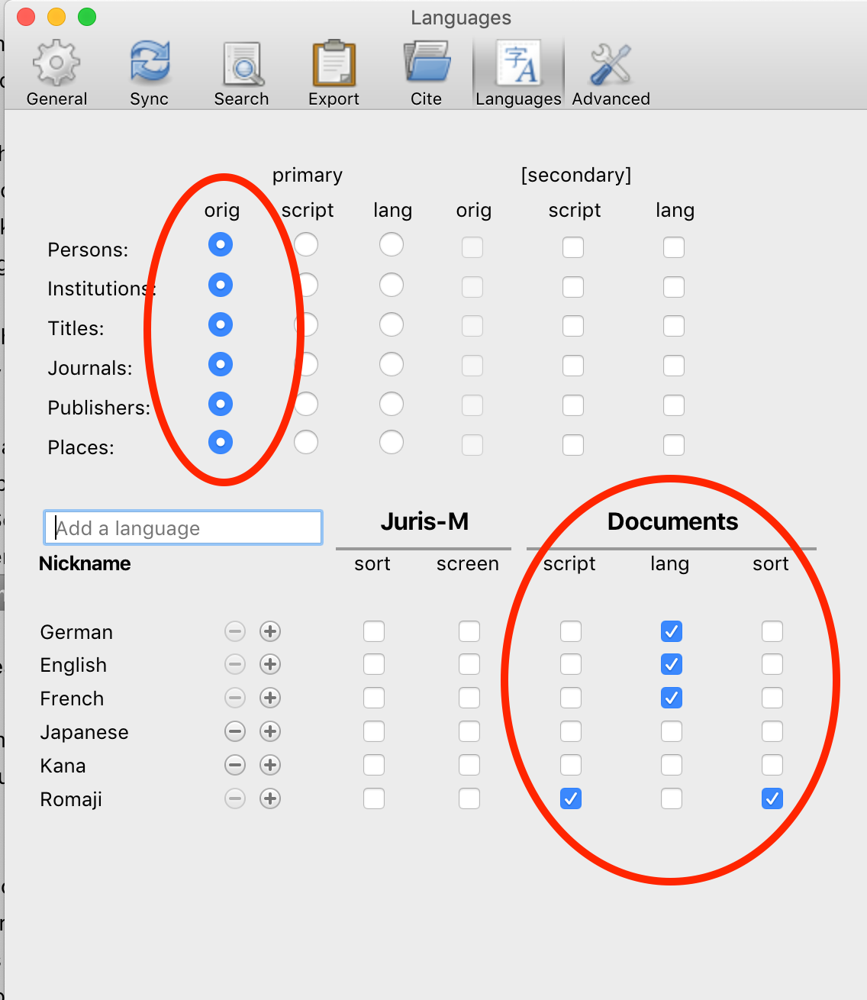

========================================================
User guide: multilingual publications and bibliographies
========================================================

.. include:: substitutions.txt
|CCBYSA|_ `Jonathan Lewis <http://www.soc.hit-u.ac.jp/en/academics/faculty/lewis.html>`_

~~~~~~~~~~~~
Introduction
~~~~~~~~~~~~

You are a social scientist (or a humanities scholar, or some other kind of researcher). You read and cite previous research written in two or more languages, and you need a way to record and manage all those references. You write articles in both English and another language.

Each journal has its own requirements about how to format bibliographies. For example, when you cite a Japanese work in a Japanese journal you will just use the original author, title and so on, but when you cite the same work in an English journal you may have to write the author and title in roman characters and add an English translation of the title.  With Jurism you can store all the information necessary to produce these different citation formats in one place. This means you can maintain one database of all your citations and keep all information about each work together, regardless of which language that information is in. Best of all, you can use Jurism to automatically generate bibliographies in the format required by whichever journal you are writing for, whichever language you are writing in.

In this tutorial we will imagine we are doing research on Japanese whaling; we collect information on the subject in English and Japanese, and write two articles, one in English and one in Japanese.

~~~~~~~~~~~~~~~~~~~~~~~~~~~~~~~~~~~~~~~~~~~~~~~~~~~
Setting up Jurism to store multilingual information
~~~~~~~~~~~~~~~~~~~~~~~~~~~~~~~~~~~~~~~~~~~~~~~~~~~

If we want to cite a Japanese work in an English article we will need to write the title, author etc. in roman characters rather than kanji and kana. Similarly, if we are writing an article in Japanese and the bibliography must be sorted according to the kana reading of the authors' names, we need to add the yomikata of the authors' names to our database.

In order to do these things we add entries for English, Japanese, romaji and kana to Jurism's language preferences, as the following video shows. After opening Jurism's Preferences in the menu we click the Languages tab. Then we click "Add a Language" and add English; we change the nickname from en to English (the nickname can be anything you like; you can leave it as en if you prefer). Next we add Japanese in the same way. After that we click the Plus sign next to Japanese and from the Variant sub-menu we select "ALA-RC Romanization, 1997 Edition". We change the nickname from "ja-alalc97" to Romaji. Finally we once again click the Plus sign next to Japanese and from the "script" sub-menu we select "Japanese syllabaries (alias for Hiragana + Katakana) -- Hrkt". We change the nickname from "ja-Hrkt" to Kana.

.. raw:: html

    

        <iframe src="https://www.youtube.com/embed/TnlCLDChIWQ" frameborder="0" allowfullscreen style="position: absolute; top: 0; left: 0; width: 100%; height: 100%;"></iframe>
    

~~~~~~~~~~~~~~~~~~~~~~~~~~~~~~~~~~~~~~~~~~~~~
Getting bibliographic information into Jurism
~~~~~~~~~~~~~~~~~~~~~~~~~~~~~~~~~~~~~~~~~~~~~

One of Jurism's great strengths is its ability to work with your web browser to recognize and grab bibliographic information contained in web pages. The following video shows us creating a new collection in Jurism, then adding four whaling-related items. We'll search CiNii for items about whaling and add a Japanese article by Morishita, go to Japanese Amazon to find information about Dolin's book in English, then to Google Scholar for one of Blok's articles in English, and finally back to Japanese Amazon to get details of Akamaine's Japanese book. You'll see how the items get added to the currently selected collection in Jurism.

.. raw:: html

    

        <iframe src="https://www.youtube.com/embed/8a-enPbggWM" frameborder="0" allowfullscreen style="position: absolute; top: 0; left: 0; width: 100%; height: 100%;"></iframe>
    

	

You can manage all your references in Jurism by creating folders and adding tags. The same item can be put into multiple folders. You can also attach links to PDF files. For further information see the "Using Zotero" section of the `Zotero documentation <https://www.zotero.org/support/>`_ .

As you have probably already realized, the first and most important principle for storing information in Jurism is that item metadata should always be recorded in the original language in the first instance. Translations and transliterations can be entered later as they are needed; but the purpose of a citation is to lead the reader or the researcher back to the original source. If the title of a document in Russian, Khmer, Laotian or Japanese is entered as an English translation, data is lost---the reader is forced to guess at the original title if they want to find the original document. Therefore, all item metadata (except for dates) should be recorded in the original language. The variants can be added separately at a later time.

~~~~~~~~~~~~~~~~~~~~~~~~~~~~~~~~~~~~~~~~~~~~
Multilingual citations in an English article
~~~~~~~~~~~~~~~~~~~~~~~~~~~~~~~~~~~~~~~~~~~~

We're preparing a manuscript for submission to the Journal of Asian Studies. The Journal's `information page <https://www.cambridge.org/core/journals/journal-of-asian-studies/information/instructions-contributors>`_ tells us to follow `Chapter 15 <https://www.chicagomanualofstyle.org/16/ch15/ch15_toc.html>`_ of the Chicago Manual of Style, 16th edition.

Looking at the sample article on the journal's web page, we see that non-English works are written as follows in the bibliography:

AYMONIER, ÉTIENNE. 1904. *Le Cambodge. Le groupe d’Angkor et l’histoire* [Cambodia: The Angkor complex and history]. Paris: Leroux.

BAN CHẤP HÀNH ĐẢNG BỘ TỈNH BẠC LIÊU. 2002. *Lịch sử Đảng bộ tỉnh Bạc Liêu (1927– 1975)* [History of the party in Bạc Liêu Province]. Vol. 1. Bạc Liêu: Ban Thường Vụ Tỉnh Ủy.

So we need to render all Japanese text in roman characters and add an English translation of titles in square brackets.

We want to quote the Japanese article by Morishita and the book by Akamine in an article we are writing in English. At the moment we only have the titles, authors etc. in kanji/kana so we need to add roman transliterations of these, plus an English translation of the title of Akamine's book. First we have to tell Jurism which language each item is in. We do this by writing the two-letter language code ("ja","en" etc.) in the language field. NOTE: we have to use the two-letter language code and not the name of the language e.g. English, 日本語 etc. So if the language field has already been set to the name of a language you will need to change it to the two-letter code. Once we have done that we right-click the label next to each relevant field, choose "Add Variant", and enter the transliteration into roman characters and then an English translation of the item.

.. raw:: html

    

        <iframe src="https://www.youtube.com/embed/jV6Ee3FKzd8" frameborder="0" allowfullscreen style="position: absolute; top: 0; left: 0; width: 100%; height: 100%;"></iframe>
    

When we are ready to start citing works in our article, we set up Jurism's language preferences as follows:

The settings in the top half of the table tell Jurism to use the "script" version of the primary language, which in this case means Japanese is rendered in roman characters. Also, titles of Japanese works have an English translation added in square brackets.

The settings in the bottom half of the table tell Jurism how to sort the bibliography; Japanese works are sorted according to the romanized version of the author name.

Now we can go ahead and add citations and bibliography to our English article. Remember to check Jurism's language preferences before adding the first citation; it should be possible to change the preferences afterwards but it will save confusion if we get things right from the beginning. Once you have put your first citation into a document, Jurism's language preferences are copied to the document, so you can change the language settings in Jurism without affecting the layout of your bibliography in Word.

.. raw:: html

    

        <iframe src="https://www.youtube.com/embed/7lcx3gohTyw" frameborder="0" allowfullscreen style="position: absolute; top: 0; left: 0; width: 100%; height: 100%;"></iframe>
    

~~~~~~~~~~~~~~~~~~~~~~~~~~~~~~~~~~~~~~~~~~~~~~~~~~~~~~~~~~~
Multilingual citations in a Japanese article
~~~~~~~~~~~~~~~~~~~~~~~~~~~~~~~~~~~~~~~~~~~~~~~~~~~~~~~~~~~

Our second article on whaling is in Japanese, for submission to the Japanese Sociological Review. The journal has a detailed `style guide <http://www.gakkai.ne.jp/jss/bulletin/guide.php>`_. Jurism has implemented this style so, as long as we have the right information in the appropriate fields, we can simply add citations throughout our article and let Jurism do the work of compiling a properly formatted bibliography.

We will quote the same four sources as we did in the English article.  We already have an entry for each item in Jurism so can get on with the writing and citing. However, we know Dolin's book has been translated into Japanese and we want to cite the translation in the Japanese article. We set the item's Language field to "en>ja" and put information about the translation into the item's Extra field as shown below. Note that each translator gets a separate <alt-translator> entry, and that the translators' family and given names are divided by double bar characters "||".

Before we start adding citations to our article in Word, we need to set up Jurism's language preferences again. The settings in the top half of the preferences become very simple because we don't need to transliterate Japanese text or add English translations. However, this style says that all works (in whichever language) have to be sorted by the romanized version of the author's name. Therefore we need to tell Jurism to use the romanized version of Japanese authors' names for sorting. Of course, this means we need to add the romanized version of the author/editor information for every Japanese work we cite, even though the roman characters won't be displayed.

Now it's time to write our article. Note that for some reason when we add a citation in Word, the red-bordered window that apppears allows us to find works using roman characters ("Douglas", "Freedom" etc.) but not Japanese text. In order to insert citations to Japanese works we need to click the Jurism icon, then "Classic View", and then select the item we want to cite. Notice that details of the translation of Dolin's book are formatted correctly in the bibliography.

.. raw:: html

    

        <iframe src="https://www.youtube.com/embed/HFsRLQIDjN4" frameborder="0" allowfullscreen style="position: absolute; top: 0; left: 0; width: 100%; height: 100%;"></iframe>
    

Jurism formats your bibliography exactly as the journal's editors want it; it even formats complex entries such as translations and republications. In order to understand what you need to do to get those more complex items to display correctly, please check out the `shared library <https://www.zotero.org/groups/2295917/japan_sociological_society_examples?>`_. The library contains all the different items and variations mentioned in the journal's style guide.

(Actually, there is one tiny but annoying instruction in the JSR style guide that Jurism can't deal with automatically. That's the case of a co-written work where at least one of the authors writes their name in katakana. In such cases the characters separating the authors' names are supposed to change from ・ to ／. So for example

宮島喬・梶田孝道・伊藤るり，1985，『先進社会のジレンマ』有斐閣．

But

西垣通／ジョナサン・ルイス，2001，『インターネットで日本語はどうなるか』岩波書店．

If you are citing such works, I'm afraid you will have to edit the bibliography manually before submission.)

If you have any questions please email the `Jurism-support <https://mail.law.nagoya-u.ac.jp/mailman/listinfo/jurism-support>`_ or `Jurism-freshers <https://mail.law.nagoya-u.ac.jp/mailman/listinfo/jurism-freshers>`_ email lists.
