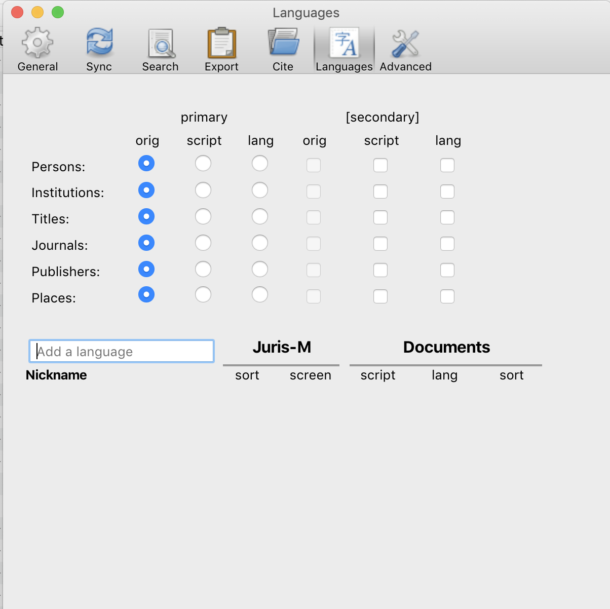

========
Tutorial
========

.. include:: substitutions.txt
|CCBYSA|_ `Jonathan Lewis`_

----------------------------------------------------
Jurism: multilingual publications and bibliographies
----------------------------------------------------

~~~~~~~~~~~~~~~~~~~~~~~~~~
Introduction: The use case
~~~~~~~~~~~~~~~~~~~~~~~~~~

You are a social scientist writing articles in both Japanese and
English. In your articles you cite works written in English, Japanese
and other languages. Each journal has its own requirements about how
to format bibliographies. For example, when you cite a Japanese work
in a Japanese journal you will just use the original author, title and
so on, but when you cite the same work in an English journal you may
have to write the author and title in romaji and add an English
translation of the title.  With Jurism you can store all the
information necessary to produce these different citation formats in
one place. This means you can maintain one database of all your
citations and keep all information about each work in one place,
regardless of which language that information is in. Best of all, you
can use Jurism to automatically generate bibliographies in the format
required by whichever journal you are writing for, whether you are
writing in Japanese, English or another language.

This tutorial will show you how to set up Jurism to store information about works written
in Japanese and English. It will then show you how to add citations
and create a bibliography when writing an article in Japanese for the
Japanese Journal of Sociology. Finally, it will show you how to add
citations and create a bibliography when writing an article in English
for the British Journal of Japanese Studies, citing Japanese works. In
both cases you will be using Microsoft Word.

~~~~~~
Jurism
~~~~~~

[forthcoming]

~~~~~~~~~~~~~~~~~~~~~~~~~~~~~~~~~~~~~~~~~~~~~
Getting bibliographic information into Jurism
~~~~~~~~~~~~~~~~~~~~~~~~~~~~~~~~~~~~~~~~~~~~~

One of Jurism's great strengths is its ability to work with your web browser to recognize and grab bibliographic information contained in web pages. Here let's do two Google Scholar searches, one for an English book and one for a Japanese book, and add the results to our database.

First, let's search for Jonathan Haidt's The Righteous Mind. When the results appear in Google Scholar, a folder icon shows up in the menu bar which means Jurism has found multiple references in this page. We click on the folder, select the first item, and it is added to our Jurism database.

.. raw:: html

    

        <iframe src="https://www.youtube.com/embed/3lZxyWU1k9M" frameborder="0" allowfullscreen style="position: absolute; top: 0; left: 0; width: 100%; height: 100%;"></iframe>
    

~~~~~~~~~~~~~~~~~~~~~~~~~~~~~~~~~~~~~~~~~~~~~~~~~~~~~~~
Setting up Jurism for working with Japanese and English
~~~~~~~~~~~~~~~~~~~~~~~~~~~~~~~~~~~~~~~~~~~~~~~~~~~~~~~

[forthcoming]

~~~~~~~~~~~~~~~~~~~~~~~~~~~~~~~~~~~~~~~~~~~~~~~~~~~~~
Adding multilingual information about works in Jurism
~~~~~~~~~~~~~~~~~~~~~~~~~~~~~~~~~~~~~~~~~~~~~~~~~~~~~

[forthcoming]

~~~~~~~~~~~~~~~~~~~~~~~~~~~~~~~~~~~~~~~~~~~~~~~~~~~~~~
Using Jurism to manage citations in a Japanese article
~~~~~~~~~~~~~~~~~~~~~~~~~~~~~~~~~~~~~~~~~~~~~~~~~~~~~~

[forthcoming]

~~~~~~~~~~~~~~~~~~~~~~~~~~~~~~~~~~~~~~~~~~~~~~~~~~~~~~~~~~~~~~~~~~~
Using Jurism to manage multilingual citations in an English article
~~~~~~~~~~~~~~~~~~~~~~~~~~~~~~~~~~~~~~~~~~~~~~~~~~~~~~~~~~~~~~~~~~~

[forthcoming]
